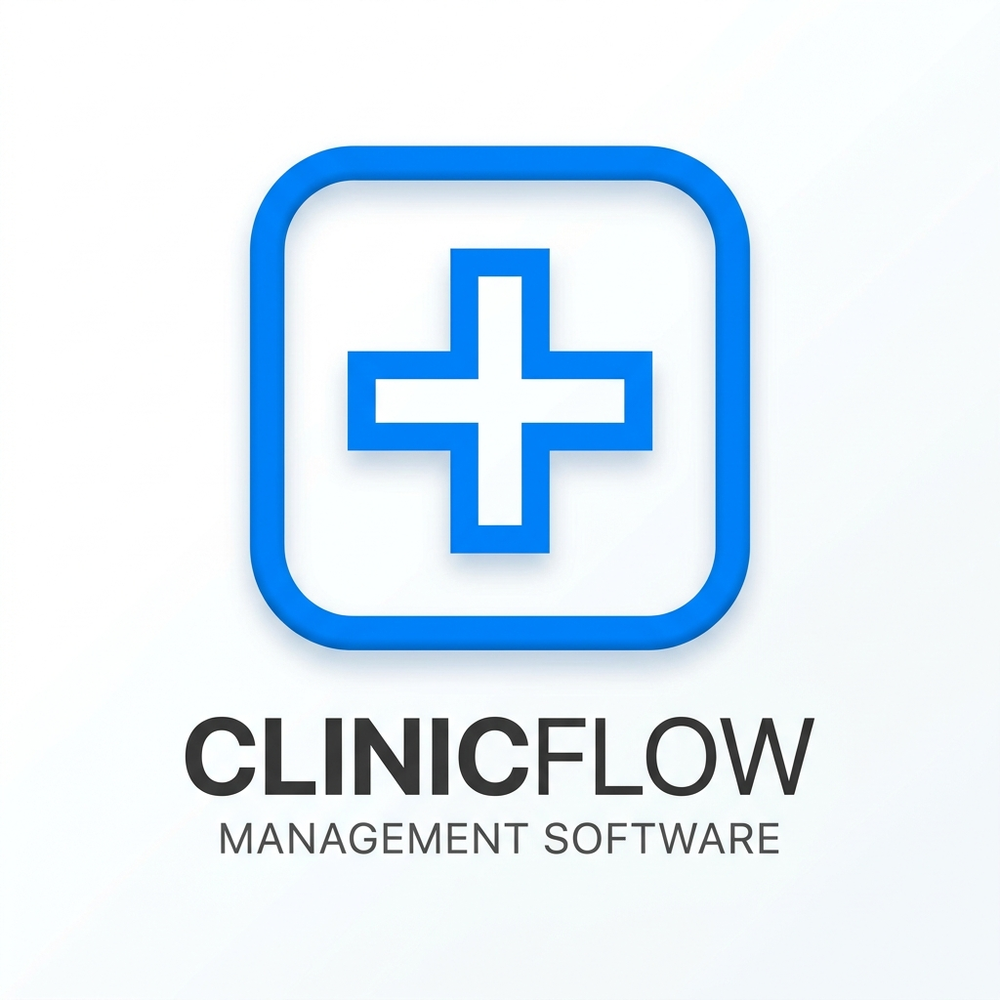

# Clinvo

  
  
<strong>Modern Offline Clinic Management & Receipt System</strong>

## Overview

Clinvo is a robust, beautifully designed desktop application built to streamline clinic operations. It handles everything from generating detailed patient receipts and tracking medical histories, to providing deep financial insights—all within a strictly offline environment. Patient data is securely stored locally on the machine via an embedded SQLite database, guaranteeing complete privacy, compliance, and zero internet dependency.

## 🚀 Key Features

### Patient & Clinical Management
- **Smart Receipt & Prescription Editor** — Create professional receipts that combine financial billing with clinical notes.
- **Prescription Tracking** — Log prescribed medicines alongside dosage, frequency, and duration.
- **Patient History Archive** — Access a comprehensive, chronological view of a patient's previous visits, diagnoses, and payment records.
- **Doctor & Service Directory** — Manage an internal directory of doctors, their specializations, and standardized clinic services with fixed pricing.

### Financial Tracking & Reporting
- **Multi-Mode Payments** — Native support for Cash, Online (UPI/Card), and Free (pro-bono) payment tracking.
- **Advanced Financial Dashboard** — Monitor clinic earnings instantly with filtering for Month-to-Date (MTD), Year-to-Date (YTD), and custom date ranges.
- **Data Exporting** — Export patient data and financial summaries effortlessly to Excel (`.xlsx`) or PDF.

### Security & Privacy
- **Secure PIN Lock** — Protect sensitive medical and financial data using a customizable 4-digit PIN lock screen that initializes on app startup.
- **Recovery Key System** — A secure 12-character alphanumeric recovery key ensures you never get permanently locked out of your data.
- **Developer Mode** — A hidden administrative mode protected by a separate Developer PIN for configuring advanced app behaviors.
- **Offline Licensing Engine** — Built-in offline cryptographic license verification system supporting trial periods, expirations, and secure activations.

### Reliability & Design
- **Automated Rolling Backups** — The app automatically creates a local database backup on the first open of every day, maintaining a rolling 7-day retention policy.
- **Premium Responsive UI** — A meticulously crafted, dynamic user interface built with modern CSS, glassmorphism, smooth micro-animations, and full responsive support for small, snapped windows.
- **Offline-First Architecture** — Lightning fast performance with absolutely zero internet connection required.

## 🛠️ Technology Stack

| Layer | Technology |
|---|---|
| **Frontend** | React 19, TypeScript, Vite |
| **Desktop Environment** | Electron |
| **Database** | SQLite via `better-sqlite3` |
| **Export/Reporting** | `xlsx` for Excel, native Electron PDF printing |
| **Styling & UI** | Pure CSS (Responsive, Modern UI) |
| **Icons & Utils** | `lucide-react`, `date-fns` |

## 📦 Releases

Pre-built standalone installers for both **macOS** and **Windows** can be found on the [Releases](https://github.com/arvinder004/clinvo/releases) page. 

## ⚖️ License

Clinvo is proprietary software. All rights reserved. Unauthorized distribution, copying, or modification is strictly prohibited.
